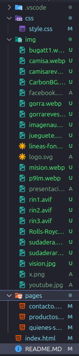

# Tienda en linea Manossory - Sebastián Linero

## Descripción
Este proyecto es un sitio web de ventas para Mansory en el cual se muestren sus productos para atraer clientes, hicimos el proyecto por carpetas separando las secciones una web estatica en local para mansory mostrando algo de ellos
 web estaticas
 tiene las siguentes secciones inicio, quienes somos, productos, contatcto
diseño adaptativo animaciones

**ruta de destino:** prueba-HTML-Sebastian-Linero
para ver el proyecto descargas el zip e inicias el index.html para iniciar la pagina web

## Información del Coder creador
- **Nombre:** Sebastián Linero  
- **Clan:** Caiman
- **Correo:** sebastianlinero15@gmail.com
- **Documento:** 1.193.266.466

## Instrucciones
1. Clona el repositorio 
2. Abre `index.html` en tu navegador.
3. Explora el portafolio y contáctame.

## Estructura del repositorio

## Recursos usados
- Imágenes libres de derechos
- Fuentes de Google Fonts
- Web oficial de Mansory